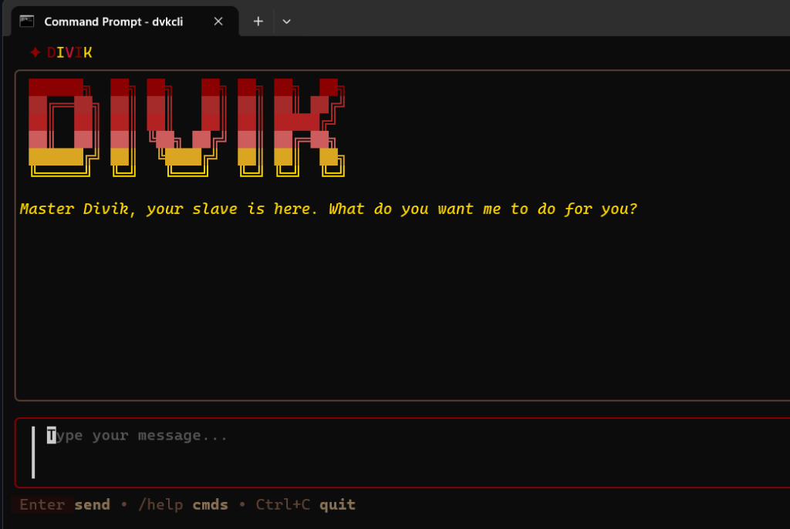

# dvkcli   , go get ur own pocket gpt lol
A local-first AI terminal assistant powered by Ollama. Personal pocket AI for conversations, coding, and work.



## Features

- **Local-First** - Runs entirely on your machine with Ollama
- **Memory** - Remembers past conversations with semantic search
- **Fast** - Single Go binary, instant startup
- **Customizable** - Wine and gold theme, configurable models

## Installation

### Prerequisites

1. Install [Ollama](https://ollama.ai/download)
2. Pull a model:
```bash
ollama pull qwen2.5:3b
```

### Install dvkcli

```bash
go install github.com/diiviikk5/dvkcli/cmd/dvkcli@latest
```

Or build from source:
```bash
git clone https://github.com/diiviikk5/dvkcli.git
cd dvkcli
go install ./cmd/dvkcli
```

## Usage

```bash
dvkcli
```

### Commands

```
/help              Show all commands
/models            List available Ollama models
/search <query>    Search past conversations
/clear             Clear current conversation
/export            Export chat to markdown
```

### Keyboard Shortcuts

```
Enter              Send message
Ctrl+N             New conversation
Ctrl+L             Load last conversation
Ctrl+E             Export conversation
Up/Down or j/k     Scroll
PgUp/PgDown        Page scroll
Ctrl+C             Quit
```

## Configuration

Config stored in `~/.dvkcli/config.json`:

```json
{
  "ollama_url": "http://localhost:11434",
  "model": "qwen2.5:3b",
  "embed_model": "nomic-embed-text",
  "memory_enabled": true
}
```

## Tech Stack

- Go
- Bubbletea (TUI framework)
- Lipgloss (styling)
- SQLite (memory storage)
- Ollama (local LLM)

## License

MIT
